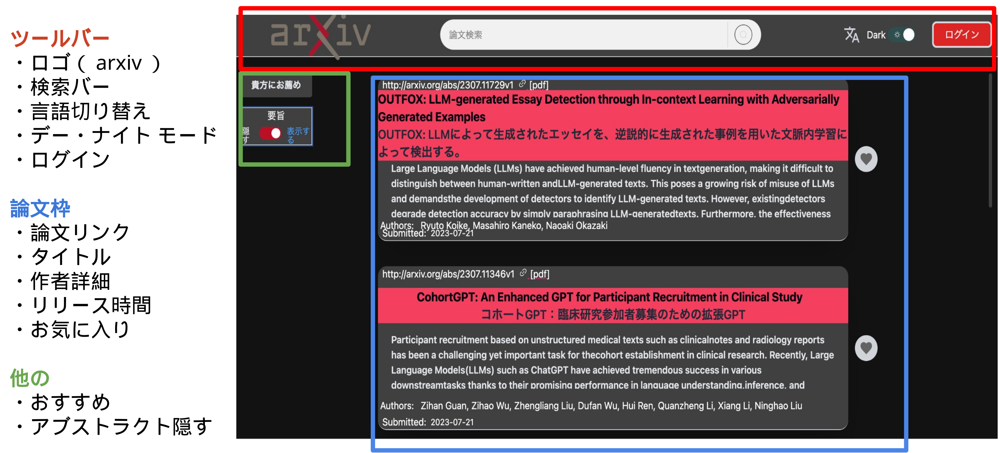
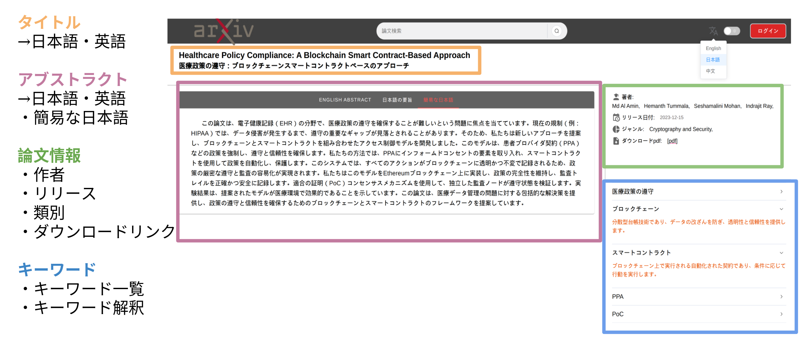

# arXiv Friends
arXivの英語論文を専門外の人にもわかりやすく日本語で。

## 画面

home_page

detail_paper

## 主な機能

- 翻訳機能
- 論文を平易に言い換える機能
  - GPTを使用
  - 専門的な内容を省き、よりコアとなる箇所を抜粋 (背景、手法、結果)
- キーワード解説
  - GPTにより論文中のキーワードを 5つ取得し解説
- 人気の高い論文を表示する機能、お気に入り機能

## Architecture

システムは以下のような構成です。フロントにはVue.js、サーバーにはDjangoを使用しています。

