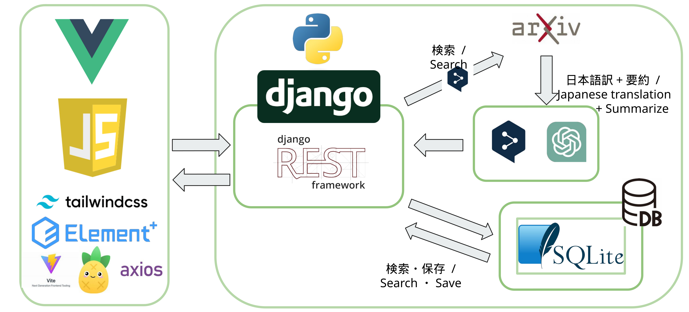
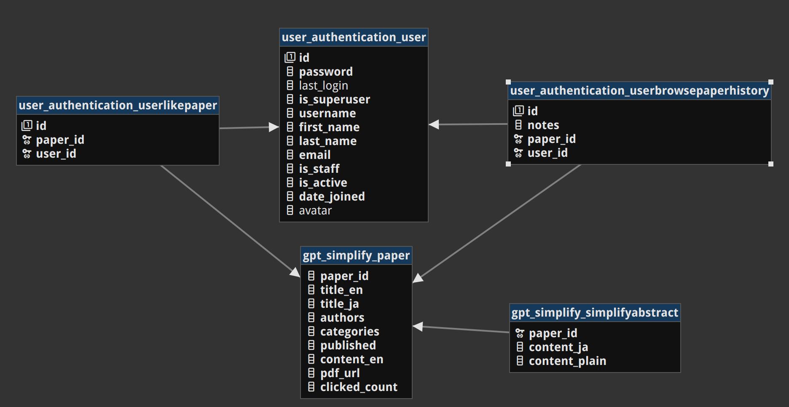

# arXiv Friends
要約自動翻訳と簡易化機能付きの論文検索管理アプリ

## Demo Video

https://github.com/hl-tang/arXiv-friends/assets/98689797/26dcb3f8-3b1e-4b6b-8cee-f3d494222714

## 主な機能

- arXivから論文検索
- 翻訳機能、LLMにより概要を分かりやすく言い換える機能
- お気に入り機能、メモ機能、閲覧履歴機能
- 人気の高い論文を表示する機能

## Architecture

システムは以下のような構成です。フロントにはVue.js、サーバーにはDjangoを使用しています。

## Database Design

