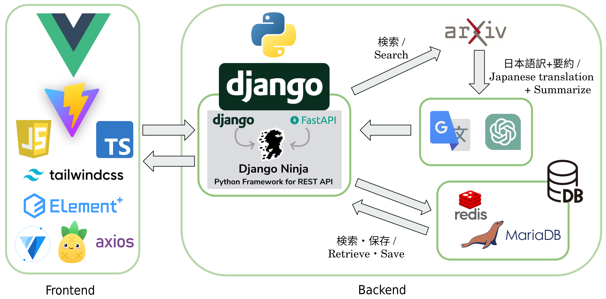

# arXiv Friends
arXivの英語論文を専門外の人にもわかりやすく日本語で。

## 画面

home_page


detail_paper


## 主な機能

- 翻訳機能
- 論文を平易に言い換える機能
  - GPTを使用
  - 専門的な内容を省き、よりコアとなる箇所を抜粋 (背景、手法、結果)
- キーワード解説
  - GPTにより論文中のキーワードを 5つ取得し解説
- 人気の高い論文を表示する機能、お気に入り機能

## Architecture

システムは以下のような構成です。フロントにはVue.js、サーバーにはDjangoを使用しています。




## API Keyの設定
`./server/App_Folder/`下のディレクトリに.envファイルを作成。

そこにOpenAI APIとDeepL APIのそれぞれのキーを書いておく。こちらは各自で取得。
````
OPENAI_API_KEY = ~OpenAI API Key~

DEEPL_API_KEY = ~DeepL API Key~
````

## プロジェクトの使用の立ち上げ方
### Step.1 Server　
`./server`フォルダに移動する。

まず、1回目のみ以下を実行する。
````
python manage.py migrate
````

次に以下を実行する。
````
python manage.py runserver
````
その状態で、
http://localhost:8000
を起動する。


### Step.2 Client　
Node.jsをDownload(https://nodejs.org/ja/download)

次に`./client`というフォルダーに移動する。

まず、1回目のみ以下を実行する。
````
npm install
````
次に以下を実行する。
````
npm run dev
````

その状態で、
http://localhost:5173
を起動する。